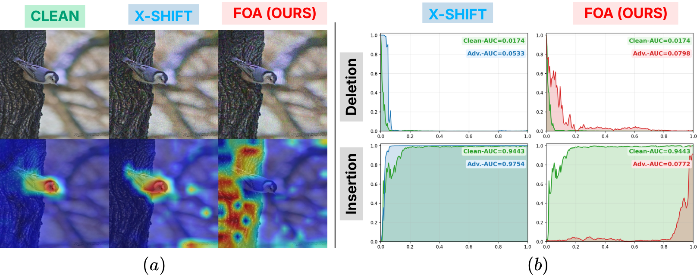
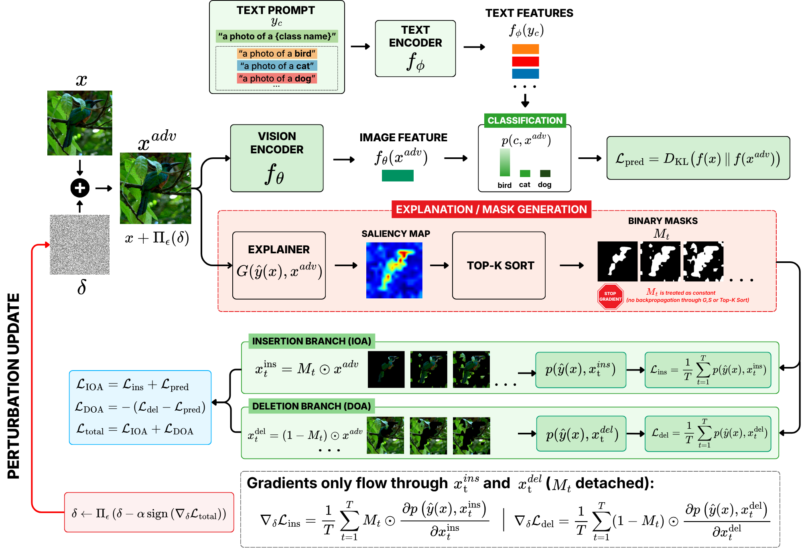

# Faithfulness Oriented Adversarial (FOA) Attack to VLMs

Script-first runbook for adversarial explanation robustness experiments.







## 1) Key files and locations
- Main attack/evaluation entrypoint: ./adv_score.py
- FOA implementation file: ./RISE/evaluation.py
- Core class: JointAdversarialCausalMetric
- Core method: JointAdversarialCausalMetric.single_run(...)


## 2) Run attack scripts (IOA, DOA, FOA)

Mode mapping:

- del -> DOA
- ins -> IOA
- del+ins -> FOA

### 2.1 Single explainer

```powershell
python .\adv_score.py \
  --clip-model ViT-B/16 \
  --clip-checkpoint .\checkpoints\ViT-B-16.pt \
  --hm-type eclip \
  --mode del+ins \
  --img-dir .\images\imagenet-val \
  --sample-path .\classification_reuslt\imagenet\vit_b_16_1k.json \
  --output-dir .\outputs\result_16\ImageNet\CLIP_ViTB16\ins_del_optimized_output \
  --eps 16 \
  --alpha 4 \
  --pgd-steps 50 \
  --process-batch-size 100
```

### 2.2 Multiple explainers

```powershell
foreach ($hm in @("eclip","game","gradcam","maskclip","rise")) {
  python .\adv_score.py \
    --clip-model ViT-B/16 \
    --clip-checkpoint .\checkpoints\ViT-B-16.pt \
    --hm-type $hm \
    --mode del+ins \
    --img-dir .\images\imagenet-val \
    --sample-path .\classification_reuslt\imagenet\vit_b_16_1k.json \
    --output-dir .\outputs\result_16\ImageNet\CLIP_ViTB16\ins_del_optimized_output \
    --eps 16 --alpha 4 --pgd-steps 50 --process-batch-size 100
}
```

## 3) Run ROAD evaluation

```powershell
python .\main_script\ROAD_evaluate_and_export.py \
  --root-dir .\outputs\result_16 \
  --clip-checkpoint .\checkpoints\ViT-B-16.pt \
  --output-root .\outputs\ROAD\eps_16 \
  --datasets ImageNet CUB StandfordPet \
  --explainers eclip game gradcam maskclip rise \
  --approaches ins_del_optimized_output \
  --model-subdir CLIP_ViTB16
```

Note: this script currently expects the dataset token StandfordPet.


## 4 Quick FOA run

```powershell
python .\adv_score.py \
  --clip-model ViT-B/16 \
  --clip-checkpoint .\checkpoints\ViT-B-16.pt \
  --hm-type eclip \
  --mode del+ins \
  --img-dir .\images\imagenet-val \
  --sample-path .\classification_reuslt\imagenet\vit_b_16_1k.json \
  --output-dir .\outputs\result_16\ImageNet\CLIP_ViTB16\ins_del_optimized_output \
  --eps 16 --alpha 4 --pgd-steps 50 --process-batch-size 64
```

